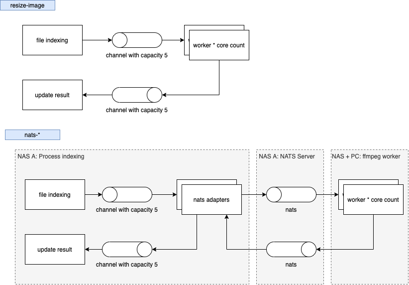

## development

 ```bash
go build nats-resize.go
go build nats-fileindex.go
go build resize-image.go
```

## result

Test environment:

- PC: AMD Ryzen 9 3900XT 12-Core Processor
- NAS: NAS TS-1282
- 150 pictures

### v1

```bash
./resize-image nature output
```

result

- PC: 150 pics = 0.036 pic/sec (70.59s user 31.81s system 1883% cpu 5.438 total)
- NAS: 150 pics =  0.046 pic/sec (0m7.004s)

### v2

```bash
./nats-server
time ./nats-fileindex 127.0.0.1:4222 nature
sudo ./nats-resize -w 2 172.17.34.72:4222 ~/mnt/nfs/thumbnail/nature ~/mnt/nfs/thumbnail/output
```

result

- PC*1:  0m23.568s
- PC*24: 0m5.996s
- NAS*7: 0m8.218s
- PC*24 + NAS*7: 0m6.123s
- PC*24 + NAS*2: 0m7.560s

### conclusion

1. NATS: 0.036 -> 0.040 -11%
2. NATS: 0.046 -> 0.055 -19%
3. 單獨 PC 很好
4. 單獨 PC indexing 速度要快
5. PC + NAS比單獨 PC 差
